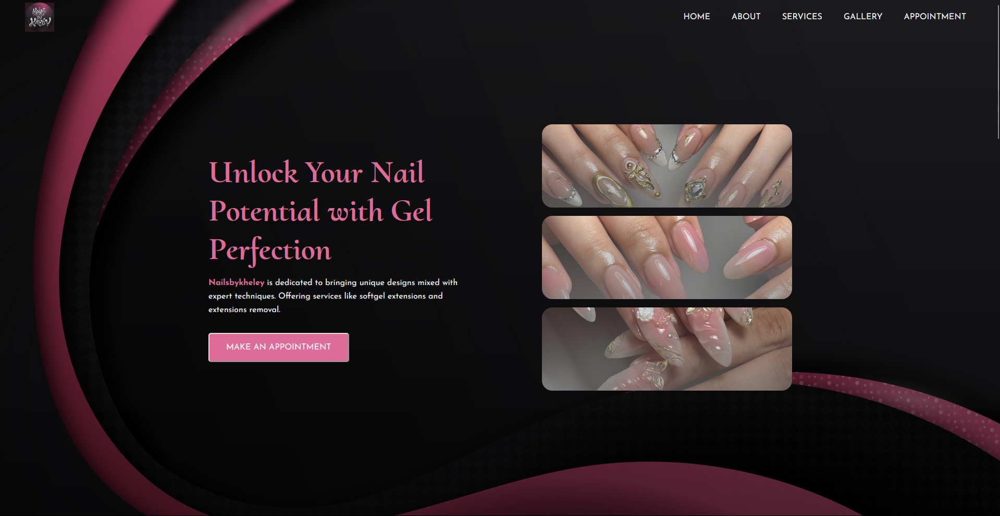
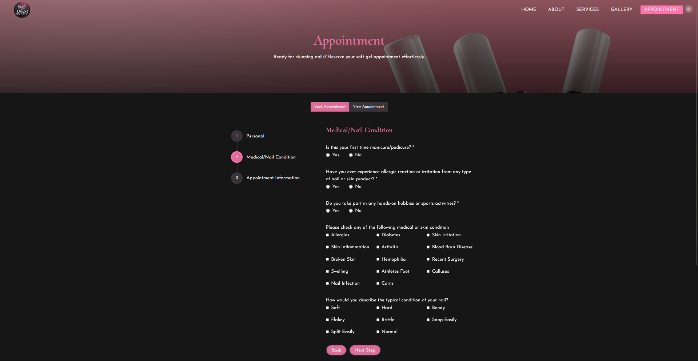
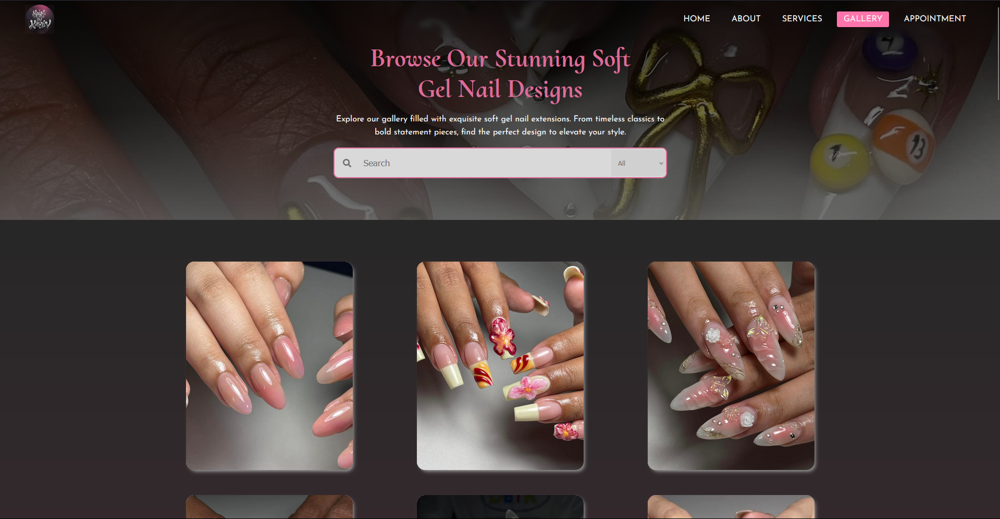
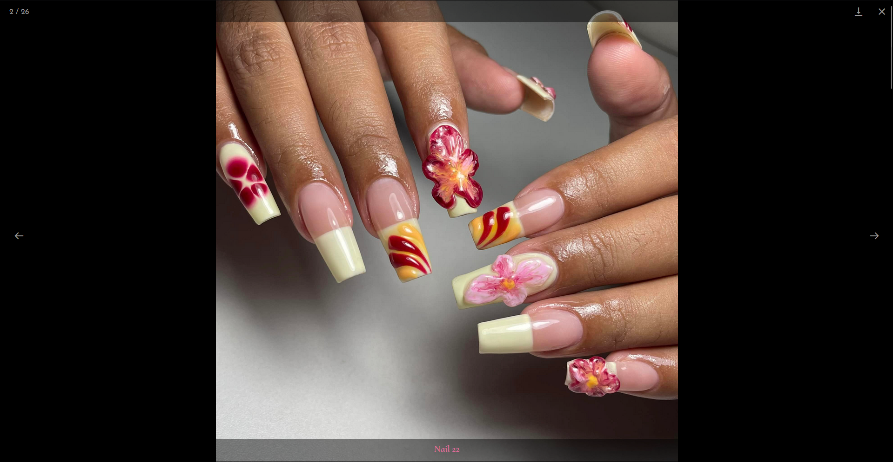
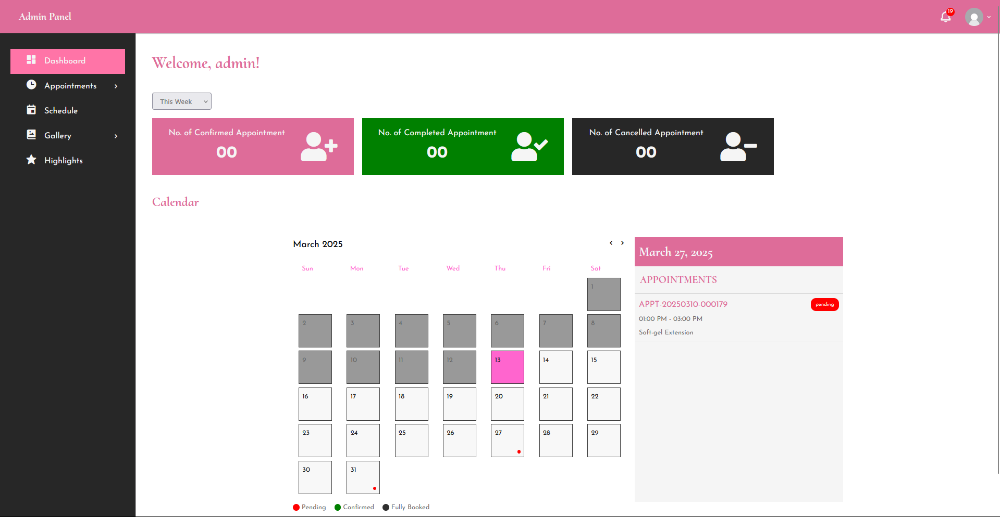

# Nail Salon Website - Nailsbykheley

This project was created during our 2nd-year finals in school for a real-world client, the owner of a nail salon. The goal was to develop a professional showcasing website with a booking system for their services.

## 📌 Features

Service Showcase – Display various nail salon services with images and descriptions.

Appointment Booking System – Clients can book appointments online.

Gallery – View past works and styles.

Admin Dashboard – Manage bookings and services.

Responsive Design – Works across desktop, tablet, and mobile.

## 🖼️ Screenshots

Home Page

Booking Page

Gallery Page

View Picture

Admin Dashboard

## 🛠️ Technologies Used

HTML, CSS, JavaScript

PHP (for backend processing)

PHPMAILER (for sending email notifications)

MySQL (for database management)

## 📄 License

This project was developed for a specific client and is intended for development purposes only, not for commercial redistribution.